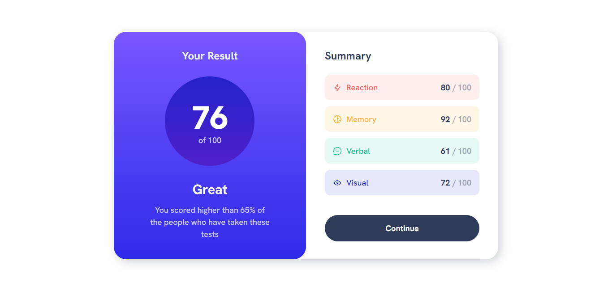
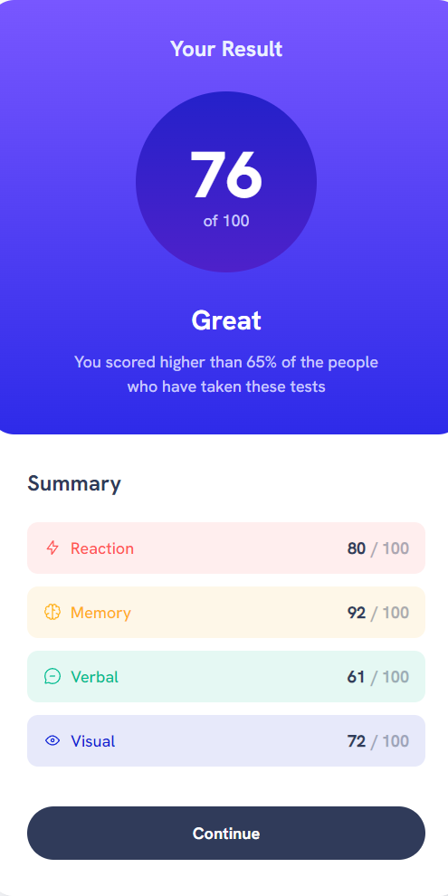

# Frontend Mentor - Results summary component solution

This is a solution to the [Results summary component challenge on Frontend Mentor](https://www.frontendmentor.io/challenges/results-summary-component-CE_K6s0maV). Frontend Mentor challenges help you improve your coding skills by building realistic projects. 

## Table of contents

- [Overview](#overview)
  - [Screenshot](#screenshot)
  - [Links](#links)
  - [Built with](#built-with)

**Note: Delete this note and update the table of contents based on what sections you keep.**

## Overview

### Screenshot

### Links

- Solution URL: (https://github.com/Vitolacho/ResultSummaryComponent)
- Live Site URL: (https://vitolacho.github.io/ResultSummaryComponent/)

### Built with

- Semantic HTML5 markup
- CSS custom properties
- Flexbox
- Bootstrap 5.3

